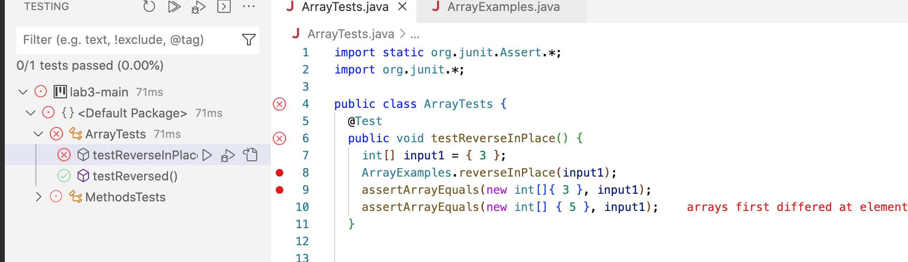

##Part Two:

Considering the first method in lab 3:


1. A failure inducing input for the testReverseInPlace method:

```
My Test Case for the method:
public void testReverseInPlace() {
    int[] input1 = { 3 };
    ArrayExamples.reverseInPlace(input1);
    assertArrayEquals(new int[]{ 3 }, input1);
    assertArrayEquals(new int[] { 5 }, input1)
```
    



2.
