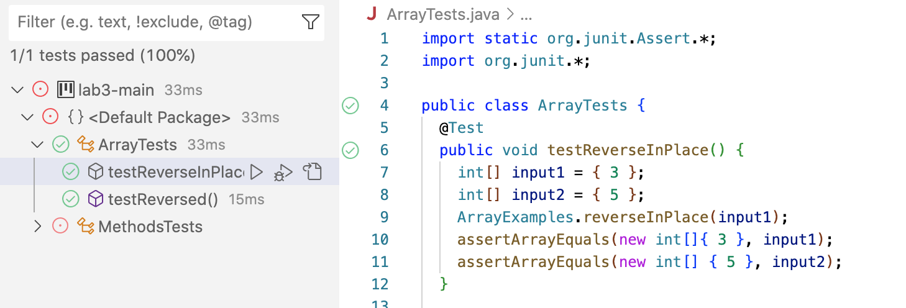

##Part Two:

Considering the first method in lab 3:


1. A failure inducing input for the testReverseInPlace method:


My Test Case for the method:
```
public void testReverseInPlace() {
    int[] input1 = { 3 };
    ArrayExamples.reverseInPlace(input1);
    assertArrayEquals(new int[]{ 3 }, input1);
    assertArrayEquals(new int[] { 5 }, input1); //My test case input that failed
```
    


2. An input that doesnt induce a failure:


My Test Case for the method that doesnt fail:
```
public class ArrayTests {
	@Test 
	public void testReverseInPlace() {
    int[] input1 = { 3 };
    int[] input2 = { 5 }; // My reference to test
    ArrayExamples.reverseInPlace(input1);
    assertArrayEquals(new int[]{ 3 }, input1);
    assertArrayEquals(new int[] { 5 }, input2); //input a same type of test as the first that passed
	}
```




3. The Symptom, as the outpur of the following two tests above:


