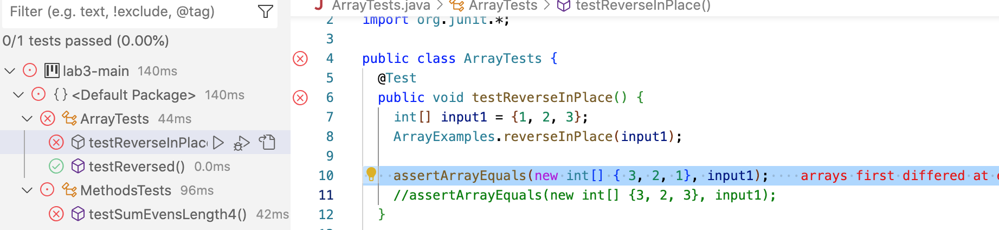
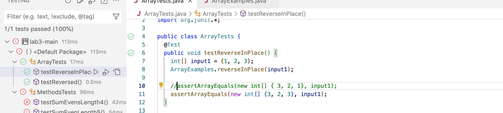
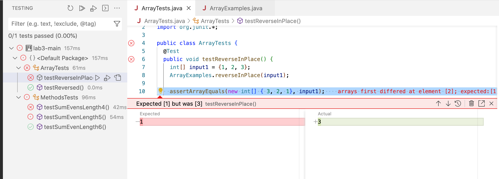

Lab Report 2 - Servers and Bugs
---

Part One:
---
Created a web server called StringServer that supports the path and behavior described. It should keep track of a single string that gets added to by incoming requests. The request will be `/add-message?s=<string>`


Part Two:
---
Considering the first method in lab 3:

The following code is suppose to reverse a list to the proper formating of a reversed list, however an issue occurs where the last index of the array isnt updated to the first index (1,4,8 actually comes out as 8,4,8 instead of 8,4,1) For Example:

1. A failure inducing input for the testReverseInPlace method:

My Test Case for the method:
```
public void testReverseInPlace() {
    int[] input1 = {1, 2, 3};
    ArrayExamples.reverseInPlace(input1);
    assertArrayEquals(new int[] { 3, 2, 1}, input1); //My test that didnt work 
```


2. An input that doesnt induce a failure:

My Test Case for the method that doesnt fail:
```
public void testReverseInPlace() {
    int[] input1 = {1, 2, 3};
    ArrayExamples.reverseInPlace(input1);

    assertArrayEquals(new int[] {3, 2, 3}, input1); //test that doesnt produce failure
```


3. The Symptom, as the output of the following two tests above:




4. The bug(code)

looked something like this before the fix:\
```
static void reverseInPlace(int[] arr) {
    int[] temp = new int[arr.length];
    for(int i = 0; i < arr.length; i += 1) {
      arr[i] = arr[arr.length - i - 1];
    }
    arr = temp;
  }
```

*The code before any fixes would get the first index of the array and adjust it to the last index element, however will not adjust the last element and instead have the last element remain the same as it was oringally. Making the reverse method not expect the right pattern.

lookedlike this after the fix:\
```
static void reverseInPlace(int[] arr) {
    for(int i = 0; i < arr.length/2; i += 1) {
      int temp = arr[i];
      arr[i] = arr[arr.length - i - 1];
      arr[arr.length - i -1] = temp;
    }
  }

```

*The code now will only take half of the loop and had the variable temp store the index of the first index in the array and have that value added in the last element in the array


Part Three:
---

One thing I learned from labe 2 is the whole set up itself of GitHub. I first had no clue how GitHub worked or what it was even for. Majority of the professors I have had in the past quarters Would have their own GitHub page and I as a student will easily access the code they want their students to work on. I am so fascinated about the structure of creating a resporitory and how much thought/work it takes to implement in making a new page or even the amount of detail it takes to explain one concept.
